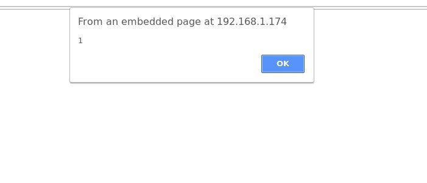

# Oracle Webcenter Interaction: Reflected XSS in Page Rename

**CVE:** CVE-2018-16953

**CVSSv3:** 5.4 - CVSS:3.0/AV:N/AC:L/PR:N/UI:R/S:U/C:L/I:L/A:N

**Versions affected:** 10.3.3 (10.3.3.379633)

## Introduction

Oracle WebCenter Interaction, formerly called BEA AquaLogic User Interaction and now part of Oracle WebCenter Suite, is an integrated, comprehensive collection of components used to create enterprise portals, collaborative communities, and composite and social applications.

## Background

The Oracle WCI portal can be installed as an ASP.NET web application for IIS. The ASP.NET portal comes as compiled .NET assemblies that are linked into an IIS site of the customer's choosing.

## Vulnerability

The `DisplayResponse()` function of the `AjaxView` class in the `portalpages.dll` assembly is vulnerable to reflected cross-site scripting (XSS). The new and old names of the renamed page are reflected in a HTTP response with the content type `text/html`. Consequently, when a user renames a page in the portal, they can inject HTML and JavaScript in the name to have it executed by the browser when the response is received.

The `name` parameter to a page rename request is the entrypoint to this vulnerability. The following request demonstrates the vulnerability.

```http
GET /portal/server.pt?in_hi_space=Ajax&in_hi_control=AjaxControl&action=rename&cid=518&oid=202&name=New%20Pagef05fm%3cscript%3ealert(1)%3c%2fscript%3eiyb70vvd9r1 HTTP/1.1
Host: <HOST>
Origin: http://<HOST>
PT-HTTPRequest-Type: CLIENT_SIDE
User-Agent: Mozilla/5.0 (X11; Linux x86_64) AppleWebKit/537.36 (KHTML, like Gecko) Chrome/65.0.3325.181 Safari/537.36
Accept: */*
Referer: http://<HOST>/portal/server.pt/mypage/new_page/202
Accept-Encoding: gzip, deflate
Accept-Language: en-GB,en-US;q=0.9,en;q=0.8
Cookie: ptLastLoginAuthSource=; ASP.NET_SessionId=a5jwawbizk4bvrn0f30m4j55; plloginoccured=true
Connection: close
```

When the response is received, the injected JavaScript and HTML are executed as shown in Figure 1.



This vulnerability can be exploited by an attacker to execute malicious JavaScript in the context of an authenticated portal user's session. Because the WCI portal requires the the session cookie (`ASP.NET_SessionId`) be accessible to JavaScript (CVE-2018-16958) this vulnerability can be directly exploited to hijack the user's active session.

The root cause of this vulnerability is the direct string interpolation in `AjaxView::DisplayResponse()` in the `portalpages.dll` assembly as shown Figure 2.


## Versions Affected

This vulnerability affects version 10.3.3 of the Oracle WebCenter Interaction portal - specifically build 10.3.3.379633 (the latest version at the time of writing).

## References

N/A

## Credit

This vulnerability was discovered by Ben N (pajexali@gmail.com) 26 June 2018.

---
mainfont: Roboto
monofont: Source Code Pro
header-includes:
    - \lstset{breaklines=true}
    - \lstset{language=[Motorola68k]Assembler}
    - \lstset{basicstyle=\small\ttfamily}
    - \lstset{extendedchars=true}
    - \lstset{tabsize=2}
    - \lstset{columns=fixed}
    - \lstset{showstringspaces=false}
    - \lstset{frame=trbl}
    - \lstset{frameround=tttt}
    - \lstset{framesep=4pt}
    - \lstset{numbers=left}
    - \lstset{numberstyle=\tiny\ttfamily}
    - \lstset{postbreak=\raisebox{0ex}[0ex][0ex]{\ensuremath{\color{red}\hookrightarrow\space}}}
...