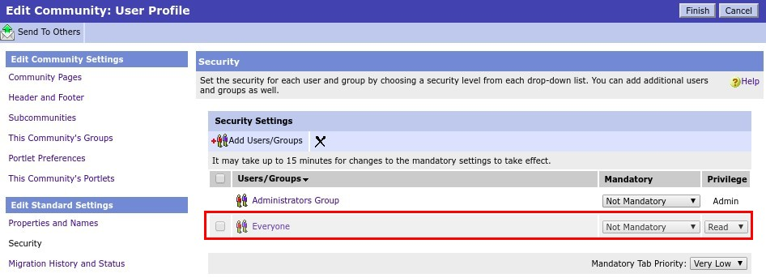

# Oracle Webcenter Interaction - Insecure Default Configuration

**CVE:** CVE-2018-16959

**CVSSv3:** 5.3 - CVSS:3.0/AV:N/AC:L/PR:N/UI:N/S:U/C:L/I:N/A:N

**Versions affected:** 10.3.3 (10.3.3.379633)

## Introduction

Oracle WebCenter Interaction, formerly called BEA AquaLogic User Interaction and now part of Oracle WebCenter Suite, is an integrated, comprehensive collection of components used to create enterprise portals, collaborative communities, and composite and social applications.

## Background

The WCI portal provides the primary user interface to WebCenter Interaction services included in the product suite. Guest and authenticated users can navigate the portal's features. The portal includes a detailed authorisation system based on objects and rights. Objects sit within containers. Objects and containers are assigned rights. A default set of rights is provided at the time of installation.

## Vulnerability

The default installation of Oracle WCI portal includes a _User Profile_ community. This commnuity allows users to view basic profile information about registered users in the portal including their registered username.

The default configuration of the User Profile community allows the _Everyone_ group read access (shown in Figure 1).



This security setting provides unauthenticated users with read access to the profile information of every registered user. Most noteably, the username of the account is included in the information provided by this community. Because the commnuity is accessed by a numerical identifier (`/portal/server.pt/user/user/[ID]`), this default configuration exposes the portal to username harvesting/enumeration attacks.

An attacker can simply access the community with increasingly incremented identifiers to extract the username of every valid user registered in the portal.

An example request is shown as follows.

```
GET /portal/server.pt/user/user/[ID] HTTP/1.1
Host: <HOST>
Connection: close
Upgrade-Insecure-Requests: 1
User-Agent: Mozilla/5.0 (X11; Linux x86_64) AppleWebKit/537.36 (KHTML, like Gecko) Chrome/65.0.3325.181 Safari/537.36
Accept: text/html,application/xhtml+xml,application/xml;q=0.9,image/webp,image/apng,*/*;q=0.8
Accept-Encoding: gzip, deflate
Accept-Language: en-GB,en-US;q=0.9,en;q=0.8
Content-Length: 0
```

The impact of this default configuration is made more severe when a customer decides to integrate active directory as an authentication source. The default security configuration of the community then exposes every active directory username synchronised with the portal.

As it is well known that customers tend to leave products in their default configuration state, the onus for reasonable product security lies with the vendor.

This default configuration unnecessarily and unknowingly exposes customers to username harvesting attacks. Once an attacker has a list of valid usernames, an attacker can trivially gain unauthorised access to the portal with brute forcing and password spraying attacks.

## Versions Affected

This vulnerability affects version 10.3.3 of the Oracle WebCenter Interaction portal - specifically build 10.3.3.379633 (the latest version at the time of writing).

## References

N/A

## Credit

This vulnerability was discovered by Ben N (pajexali@gmail.com) 26 June 2018.

---
mainfont: Roboto
monofont: Source Code Pro
header-includes:
    - \lstset{breaklines=true}
    - \lstset{language=[Motorola68k]Assembler}
    - \lstset{basicstyle=\small\ttfamily}
    - \lstset{extendedchars=true}
    - \lstset{tabsize=2}
    - \lstset{columns=fixed}
    - \lstset{showstringspaces=false}
    - \lstset{frame=trbl}
    - \lstset{frameround=tttt}
    - \lstset{framesep=4pt}
    - \lstset{numbers=left}
    - \lstset{numberstyle=\tiny\ttfamily}
    - \lstset{postbreak=\raisebox{0ex}[0ex][0ex]{\ensuremath{\color{red}\hookrightarrow\space}}}
...